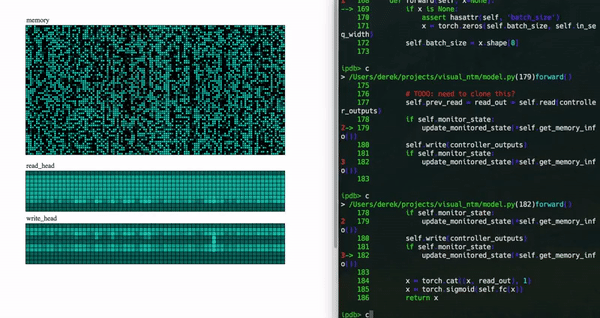
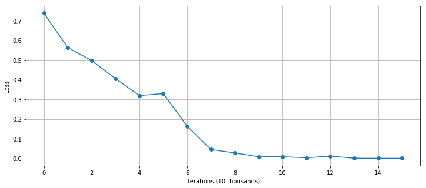

# PyTorch Neural Turing Machines with Pretty Visualizer
[Neural Turing Machines, arxiv:1410.5401](https://arxiv.org/abs/1410.5401)


(outdated picture)

This is a NTM implementation in pytorch with a memory and read/write
head visualizer. This project is intended to be instructional
as much as possible. The code is succinct and easy to understand.
The visualizer helps you to
grasp how heads and memory act with respect to an input. Currently,
the copy task has been implemted and the other tasks are planned to be 
added.

### Requirements
- python3
- pytorch 0.4
<br>
<br>

### Usage
```
usage: train.py [-h] [--sequence_length SEQUENCE_LENGTH]
                [--sequence_width SEQUENCE_WIDTH]
                [--num_memory_locations NUM_MEMORY_LOCATIONS]
                [--memory_vector_size MEMORY_VECTOR_SIZE]
                [--batch_size BATCH_SIZE] [--training_size TRAINING_SIZE]
                [--controller_output_size CONTROLLER_OUTPUT_SIZE]
                [--learning_rate LEARNING_RATE] [--momentum MOMENTUM]
                [--alpha ALPHA]
                [--min_grad MIN_GRAD] [--max_grad MAX_GRAD]
                [--load LOAD] [--save SAVE] [--monitor_state]
```
<br>

### How to run visualizer (currently being fixed after controller redeisgn)

```
cd path/to/this/project
python -m http.server 8000
```
and open another terminal

```
cd path/to/this/project
python train.py --monitor_state
```

It is a good idea to use a debugger with the visualizer like in the demo.gif.

<br>

### Sample training result

##### settings
- sequence_length: 3
- sequence_width: 10
- num_memory_locations: 64
- memory_vector_size: 32
- batch_size: 1
- controller_output_size: 256
- custom lr scheduling

##### Final mean loss is 0.000129
##### Weight saved as `pretrained` file